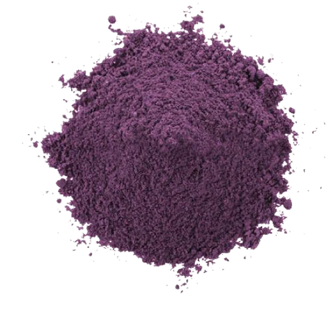

import CheekyTable from '@site/src/components/table.js';
import Tabs from '@theme/Tabs';
import TabItem from '@theme/TabItem';
import data from "./data/data.json";

export const currency = data.currency;
const money = (amt) => {
  return Math.round(amt).toLocaleString() + currency;
}
const getFinalSourceAmt = (amt) => {
  return amt * data.source_proc.dry_percent * (1 - data.source_proc.testing_percent);
}
const arraySum = (arraychik) => {
  return Object.values(arraychik).reduce((accum, curr) => accum + curr, 0);
}
const arraySumWithPricePerUnit = (arraychik) => {
  return Object.values(arraychik).reduce((accum, curr) => accum + (curr.amount * curr.price_per_unit), 0);
}
const emptyRow = (headers) => {
  return Object.fromEntries(headers.map((key) => [key, ""]))
}

# Business Plan

:::info
Current plan:

- [ ] Do more research on +/- of various drying methods
- [ ] Decide if initially a 'pilot' option of machinary (smaller scale) should be used
- [ ] Finalize drying method and select a model
- [ ] Decide on grinding process and model. Possibly a stone mill? (2 stone circle slabs, oldskool) Maybe this can be used for marketing.
- [ ] Understand packaging options. Where is the balance between environmentally friendly and cost
- [ ] Decide what package sizes there will be. Only 100g? Maybe 500g too?
- [ ] Sketch package design
- [ ] Understand how to calculate local and global demand
- [ ] Narrow down possible locations where to manufacture
- [ ] ???
- [ ] ???
- [ ] ???
- [ ] Random thought: Maybe doing a pilot run will be more beneficial? Rent equipment, buy smaller amounts of source and test print packages
- [ ] Random thought: Maybe all kinds of secondary products can be done with powders... mixing with honey, for example.
- [ ] Random thought: Maybe this production can be done in the same place where cafe can be? Then maybe cafe should be done first?
:::

## Summary

The business idea is to create a company that collects seasonal wild forest berries (initially blueberries),
processes them through freeze-drying and milling, and sells the resulting powdered products.
The target market is health-conscious consumers in Europe, with a focus on the German market.
The sales channels will be an e-commerce website and Amazon Germany.
The business will also emphasize environmentally-friendly packaging and practices.

### Objectives

1. Establish partnerships with local berry collectors.
2. Develop an efficient and high-quality freeze-drying and milling process.
3. Design and launch an e-commerce website.
4. List products on Amazon Germany.
5. Develop a social media marketing campaign.
6. Ensure compliance with food safety and quality regulations.

### [Flow Diagram](./images/diagram.png)

### Alternative source material

- [Many more forest berries](./images/forest_berry_season.png)
  - Wild Lingonberry (брусника)
  - Wild Raspberry 
  - Wild Strawberry (земляника)
- В ПРИНЦИПЕ - after diligent research and production process setup - any food category can be processed.

## Market Research and Demand

The market for wild forest berries in Latvia is significant (no proof yet), with many elderly people collecting and selling them at
local markets. However, there is a growing demand for high-quality, convenient, and healthy food products, which our
sublimated berry powders can meet.
(~~We have conducted market research and found that there is a demand for such products,
especially among health-conscious consumers.~~ - NOT YET)

- Who consumes powdered berries? (age, social group)
  - Yet to investigate
- Where to sell?
  - Amazon (15% selling fee, 15% more if amazon stores and fulfills the orders)
  - Own website
  - Local stores?
  - Food festivals?
  - B2B Shops

### Competition

#### Latvia

| Title                                                                       | Weight | Price | Rank | Ratings | Stars | Comment          |
| --------------------------------------------------------------------------- | ------ | ----- | ---- | ------- | ----- | ---------------- |
| [Absoluts Ed](https://cikade.lv/produkts/absoluts-ed-mellenu-pulveris-60g/) | 60 g   | €5.80 | N/A  | N/A     | N/A   | not freeze-dried |

#### Amazon.DE

:::info
Used a [python amazon scraper](https://github.com/Moffi-bit/Amazon-Scraper) script, updated it, also added ChatGPT invocation to translate titles from german and extract weight
:::

| Title                              | Weight | Price  | Rank | Ratings | Stars |
|------------------------------------|--------|--------|------|---------|-------|
| LOOV Bio Wild Blueberry Powder     | 100g   | €17.9  | GOOD | 1347    | 4.6/5 |
| LOOV Wild Blueberry Powder         | 171g   | €31.9  | GOOD | 1004    | 4.7/5 |
| Wild Blueberry Powder              | 90g    | €17.9  | GOOD | 922     | 4.5/5 |
| myfruits Wild Blueberry Powder     | 200g   | €19.9  | GOOD | 371     | 4.4/5 |
| Bio Wild Blueberry Powder          | 250g   | €25.9  | GOOD | 210     | 4.4/5 |
| Wild Blueberry Powder              | 250g   | €25.9  | GOOD | 210     | 4.4/5 |
| Organic Wild Blueberry Powder      | 150g   | €17.9  | GOOD | 97      | 4.3/5 |
| Wild Blueberries Organic Powder    | 200g   | €17.9  | GOOD | 92      | 4.2/5 |
| Blueberry Powder                   | 50g    | €10.47 | GOOD | 22      | 4.7/5 |
| Fitness Health Blueberry Powder    | 100g   | €21.76 | N/A  | NA      | NA    |
| Kopp Vital Wild Blueberry Capsules | 54g    | €79.99 | N/A  | NA      | NA    |

## Technology

### Freeze drying

> Freezing stage -> primary drying stage -> secondary drying stage

  
All freeze-drying terminology

  | Term | Synonyms | Description |
  |------------------------------|---------------------------------|-----------------------------------------------------------------------------------------------------------------------------------------------------------|
  | Freeze-drying | Lyophilization, Cryodesiccation | A dehydration process that involves freezing a substance and then removing the ice by sublimation in a vacuum. |
  | Sublimation | | The process where a solid (ice) changes directly into a vapor without going through a liquid phase. |
  | Primary drying | Sublimation phase | The first stage of the freeze-drying process where the majority of the ice is removed through sublimation. |
  | Secondary drying | Desorption phase | The second stage of the freeze-drying process where residual water is removed from the product to achieve the desired moisture content. |
  | Freezing | | The process of cooling the substance to below its freezing point, forming ice crystals. |
  | Annealing | | A controlled heating step during the freezing process that helps create larger ice crystals, which can speed up the sublimation process. |
  | Eutectic temperature | | The temperature at which a mixture of substances (e.g., solutes and water) freezes as a whole. |
  | Collapse temperature | Tc | The temperature at which the structure of the freeze-dried product begins to break down or lose its shape. |
  | Glass transition temperature | Tg | The temperature at which an amorphous solid (such as a freeze-dried product) transitions from a glassy, brittle state to a rubbery, viscous state. |
  | Vacuum | | A low-pressure environment created in the freeze-drying chamber to facilitate sublimation. |
  | Condenser | Cold trap | A part of the freeze-drying system that collects the vaporized ice, preventing it from contaminating the vacuum pump. |
  | Pirani gauge | | A device used to measure vacuum pressure during the freeze-drying process. |
  | Manifold freeze-drying | | A type of freeze-drying where samples are placed on a manifold connected to the vacuum system, typically used for small-scale or laboratory applications. |
  | Tray freeze-drying | Shelf freeze-drying | A type of freeze-drying where samples are placed on shelves in a chamber, allowing for more precise temperature control and larger-scale production. |
  | Bulk freeze-drying | | A method where the product is freeze-dried in bulk form (e.g., in trays), as opposed to individually packaged items. |
  | Stoppering | | The process of sealing a vial or container containing the freeze-dried product to maintain its stability and quality. |

#### Options

- [Wave](https://wave.cc/product/wave-fd260/?show=explanation)
  - Loading volume: 115L
  - Price starting: 23,700EUR
  - Energy consumption: 1.5kW/h (24hrs per batch = `24*1.5 * (115\*30 (batches)) = 1080kW = 100-180EUR` (https://www.elektroenergija.lv/?kwh=1080))
- [Forlong](https://www.gellerteng.com/CRYO-300#forlong)
  - Loading volume: 40-60KG+
  - Price starting: Requested a quote for 100KG loading volume machines - the price is 200,000EUR...

#### Some more options as per GPT4 (not checked this yet)

| Machine Model        | Manufacturer          | Capacity (kg) | Price Range (EUR) | Energy Consumption (kW) | Time of Operation | Energy Cost per 1000 kg (EUR) |
|----------------------|-----------------------|---------------|-------------------|-------------------------|-------------------|-------------------------------|
| Harvest Right Large  | Harvest Right         | 5.4           | 6,000-9,000       | 2.5                     | 24-48 hours       | 270-405                       |
| Cuddon FD5           | Cuddon Freeze Dry     | 5             | 15,000-25,000     | 3.5                     | 24-48 hours       | 378-567                       |
| Cuddon FD80          | Cuddon Freeze Dry     | 80            | 40,000-60,000     | 15                      | 24-48 hours       | 1,620-2,430                   |
| VirTis BenchTop Pro  | SP Scientific         | 2.5           | 8,000-14,000      | 1.5                     | 24-48 hours       | 162-243                       |
| Freeze Dryer Epsilon | MechaTech Systems Ltd | 20            | 35,000-55,000     | 6                       | 24-48 hours       | 648-972                       |
| Labconco FreeZone 12 | Labconco              | 12            | 25,000-40,000     | 4.5                     | 24-48 hours       | 486-729                       |
| Zirbus Sublimator 3x | Zirbus Technology     | 3             | 10,000-20,000     | 1.8                     | 24-48 hours       | 194-291                       |

#### Research on drying methods

- https://www.researchgate.net/publication/244603417_Drying_of_Fruits_and_Vegetables_Retention_of_NutritionalFunctional_Quality
- [Effect of Selected Drying Methods and Emerging Drying Intensification Technologies on the Quality of Dried Fruit: A Review](https://www.mdpi.com/2227-9717/9/1/132)
- However, in comparison to other drying technologies, **freeze-drying has a high energy consumption** and prolonged processing time. However, this can be reduced by using PEF treatment. For instance, Lammerskitten et al. reported that PEF pretreatment of apple slices intensifies freeze-drying kinetics and thus reduces processing time by 57% in comparison to untreated samples.
- [Research on Pros and Cons of PEF processing](https://www.ncbi.nlm.nih.gov/pmc/articles/PMC7847884/)
- `Blueberry fruits (Vaccinium myrtillus L.) Increasing the juice yield (+ 28%) compared to the untreated sample. The juice obtained had a significantly higher total phenolic content (+ 43%), total anthocyanin content (+ 60%) and antioxidant activity (+ 31%)`
- [Dude makes a freeze drier. lots of science](https://freezedryer.rcasteel.com) - can get interesting insights on how freeze-drying actually works

  
Comparison of drying methods as per GPT4

  | Drying Method | Advantages | Disadvantages | Price Range (USD) | Time of Operation |
  |-----------------------|-----------------------------------------------------------|--------------------------------------------------------|-------------------|------------------------|
  | Freeze Drying | Preserves nutritional value, color, and taste | Expensive equipment, energy-intensive |
  50,000-100,000 | 24-48 hours |
  | Spray Drying | Fast process, scalable | High temperatures may affect nutrients, energy-intensive | 40,000-80,000 |
  20-30 minutes |
  | Vacuum Drying | Retains some nutritional value, lower temperatures | Slower process, expensive equipment |
  20,000-50,000 | 12-24 hours |
  | Air Drying | Low-cost, low energy consumption | Longer drying time, potential loss of nutrients | 5,000-10,000 | 1-5
  days |
  | Dehydration (Oven) | Accessible, relatively low-cost | High temperatures may affect nutrients, energy-intensive |
  500-2,000 | 6-12 hours |
  | Solar Drying | Low-cost, environmentally friendly | Slow, dependent on weather conditions | 1,000-3,000 | 2-10 days
  (weather dependent) |

#### Contacted organizations for their production insight

  
Message I am sending:

  Hello!

  I hope this message finds you well. I am writing to inquire about your produce drying methods.
  I have heard great things about your company from Paul Chek and I am eager to learn more about your expertise in
  this area.
  While I unfortunately cannot try your products firsthand as I reside in the EU, I am interested in starting a
  dried powdered fruit business in Northern Europe and I am currently researching the best drying methods.
  With so many options available, it can be difficult to determine which methods are truly effective and safe.
  Some are advertised as "next generation," like vacuum microwave, but only few actually know that microwaves
  aren't beneficial for living organisms.
  I would greatly appreciate any insight you could provide on this subject, as well as a brief explanation of your
  own drying method, if possible.
  Thank you for your time and expertise.

  Regards,
  Dennis

- [PaleoValley](paleovalley.com)
- [Organifi](organifi.com) - got generic reply with no info, only that they use their own patented no-heat technique

### Powdering

  
Comparison of powdering methods as per GPT4

  | Milling Method | Advantages | Disadvantages | Price Range (EUR) | Time of Operation | Heat Generation |
  |----------------------|-----------------------------------------------------------|--------------------------------------------------------|-------------------|------------------------|----------------|
  | Stone Mill | Traditional, low heat generation, preserves nutrients | Slow, manual labor, less consistent particle size | 500-2,000 | Slow (hours) | Low |
  | Hammer Mill | Fast, versatile, adjustable particle size | High heat generation, noisy, potential nutrient loss | 1,000-5,000 | Fast (minutes) | High |
  | Ball Mill | Uniform particle size, low heat generation | Slow, high energy consumption, large equipment | 5,000-25,000 | Slow (hours) | Low |
  | Pin Mill | Fast, uniform particle size, low heat generation | Expensive equipment, potential clogging | 5,000-20,000
  | Fast (minutes) | Low |
  | Jet Mill | No heat generation, ultrafine particle size | Expensive equipment, high energy consumption | 25,000-100,000 | Fast (minutes) | None |
  | Roller Mill | Scalable, low heat generation, consistent particle size | Expensive equipment, high energy consumption
  | 10,000-50,000 | Medium (30-60 minutes) | Low |
  | Mortar and Pestle | Traditional, low-cost, no heat generation | Slow, manual labor, less consistent particle size | 20-200 | Slow (hours) | None |
  | Cryogenic Mill | Preserves nutrients, no heat generation, ultrafine size | Expensive equipment, requires liquid nitrogen | 15,000-80,000 | Fast (minutes) | None |

### Packaging

  
Comparison of packaging methods as per GPT4

  | Packaging Type | Packaging Machine | Advantages | Disadvantages | Machine Price Range (EUR) | Time of Operation |
  Environmental Friendliness | Price per Package (EUR) |
  |---------------------|------------------------------------|---------------------------------------------------------|----------------------------------------------------|---------------------------|----------------------|----------------------------|---------------------------------------|
  | Plastic Bags | Vertical Form Fill Seal (VFFS) | Low-cost, widely available, customizable | Not biodegradable, potential leaching of chemicals | 3,500-15,000 | Fast (30-60 sec/bag) | Low | 0.01-0.03 (1,000) / 0.01-0.02 (2,000) |
  | Paper Bags | Vertical Form Fill Seal (VFFS) | Biodegradable, lower environmental impact, customizable | Less durable, less protective | 3,500-15,000 | Fast (30-60 sec/bag) | High | 0.02-0.04 (1,000) / 0.01-0.03 (2,000) |
  | Stand-up Pouches | Stand-up Pouch Filling Machine | Convenient, resealable, customizable | Not easily biodegradable, plastic content | 7,000-35,000 | Medium (1-2 min/bag) | Medium | 0.03-0.07 (1,000) / 0.02-0.06 (2,000) |
  | Compostable Pouches | Stand-up Pouch Filling Machine | Biodegradable, lower environmental impact, customizable | Less durable, higher cost | 7,000-35,000 | Medium (1-2 min/bag) | High | 0.05-0.09 (1,000) / 0.04-0.08 (2,000) |
  | Glass Jars | Rotary Filling and Capping Machine | Reusable, no leaching of chemicals, premium appearance | Heavy, fragile, higher cost | 15,000-70,000 | Slow (2-5 min/jar) | Medium | 0.25-0.40 (1,000) / 0.20-0.35 (2,000) |
  | Metal Tins | Rotary Filling and Capping Machine | Reusable, durable, premium appearance | Higher cost, potential for corrosion | 15,000-70,000 | Slow (2-5 min/tin) | Medium | 0.20-0.35 (1,000) / 0.15-0.30 (2,000) |

#### Design

  
Design description

  1. **Background**: Use a subtle, light-colored seed of life pattern as the background, covering the entire A5 label
  area.
  2. **Forest Imagery**: Add an abstract or stylized illustration of a forest at the top or bottom of the label, using
  shades of green for a vibrant appearance.
  3. **Blueberry Powder Smudge**: Incorporate a smudge or splash of blueberry powder on one side of the label, using a
  deep blue-purple color to represent the powder.
  4. **Company Name**: Place the company name "RAbundance Nutrition" at the top or center of the label, using a modern
  and stylish font. Possibly interweave the name with an orange circle, representing sun (RA).
  5. **Product Title**: Add the product title, "Wild Organic Blueberry Powder," below the company name, using a slightly
  smaller font size.
  6. **Weight**: Indicate the weight of the product (e.g., "100g") below or beside the product title, using a smaller
  font size.
  7. **Benefits**: List the benefits of the product (e.g., "Rich in Antioxidants," "High in Vitamin C," "Supports Immune
  System") in bullet points or short phrases, placed below the weight or beside the blueberry powder smudge.
  8. **Drying Method**: Mention the drying method used (e.g., "Freeze-Dried") near the benefits section or near the
  blueberry powder smudge.
  9. **Catchy Slogan**: Add a catchy slogan or tagline (e.g., "Nature's Bounty, Unleashed") at the bottom of the label
  or near the forest illustration, using a complementary font style.

  **AI prompt to attempt logo generation:**
  Design a supplement pouch label.

  Background: Use a subtle, light-colored 'flower of life' pattern as the background.
  Forest Imagery: Add an abstract or stylized illustration of a forest at the top or bottom of the label, using shades of green for a vibrant appearance.
  Blueberry Smudge: Incorporate a smudge or splash of blueberry or blueberry powder, using a deep blue-purple color to represent it.
  Add Orange stylized sun.

  
How to make this design stand out

  1. Use **calming colors**: Choose a color palette that evokes feelings of calm and relaxation, while still being
  vibrant. This can make consumers feel more connected to the product and its natural origins.
  2. Add **certification logos**: If your product is certified organic, vegan, gluten-free, or has other notable
  certifications, include the corresponding logos on the label. This can help build trust and credibility with
  consumers.
  3. Include a **short, compelling story**: Share a brief story about the origin of the berries, the company's mission,
  or your commitment to sustainability. This can create an emotional connection and demonstrate your brand's
  authenticity and transparency.
  4. Highlight **key benefits**: Emphasize the most desirable benefits of the product, such as the health benefits,
  taste, and quality. Use bold or highlighted text to draw attention to these features.
  5. Use **high-quality images**: Incorporate high-quality, realistic images of blueberries and blueberry powder to
  showcase the product's appearance and entice consumers.
  6. Add **testimonials or reviews**: If possible, include a few short customer testimonials or positive reviews on the
  label. This can help build social proof and trust in the product.
  7. Emphasize **sustainability and eco-friendliness**: Highlight any environmentally friendly practices used in the
  production or packaging of the product. This can appeal to eco-conscious consumers and demonstrate your brand's
  commitment to sustainability.
  8. Use clear and **easy-to-read fonts**: Ensure all text on the label is legible and easy to read. Consumers
  appreciate clear communication and straightforward information about the product.
  9. Add a **QR code**: Include a QR code that directs consumers to your website or a landing page with more information
  about the product, company, and its values. This can help build trust by providing easy access to additional
  information.

## Sourcing conditions
Wild berry seasons' beginning, end and yield vary in many factors. Primarily it is weather conditions.

| Year type | Start of season          | End of season | Approximate number of days |
|-----------|--------------------------|---------------|----------------------------|
| Warm      | Mid-July to early August | Early October | 60 to 80 days              |
| Cold      | Early August             | Mid-September | 40 to 50 days              |

## Space Rental and Equipment Purchase

We will rent a space for our production and packaging operations. We will also purchase the necessary equipment for
freeze-drying, powdering, and packaging our sublimated berries.
All cost breakdown is below for - onetime, monthly and monthly-during-berry-season.

:::info

All values are coming from a [single JSON data file](./data/data.json)

:::

export const spend = {
  onetime: {
    headers: ["item", "total"],
    data: Object.entries(data.onetime).flatMap(([key, value]) => ({
      item: key,
      total: money(value)
    })),
    total: arraySum(data.onetime)
  },
  monthly: {
    headers: ["item", "total"],
    data: Object.entries(data.monthly).flatMap(([key, value]) => ({
      item: key,
      total: money(value)
    })),
    total: arraySum(data.monthly),
    total_annual: arraySum(data.monthly) * 12
  },
  operation: {
    headers: ["item", "price", "quantity", "total"],
    data: Object.entries(data.operation).flatMap(([key, value]) => ({
      item: key,
      price: `${value.price_per_unit} ${currency}/${value.unit}`,
      quantity: value.amount.toLocaleString(),
      total: money(value.price_per_unit * value.amount)
    })),
    total: arraySumWithPricePerUnit(data.operation)
  },
  source: {
    headers: ["item", "price", "quantity", "total"],
    data: Object.entries(data.sources).flatMap(([key, value]) => ({
      item: key,
      price: `${value.price_per_unit} ${currency}/${value.unit}`,
      quantity: value.amount.toLocaleString(),
      total: money(value.price_per_unit * value.amount)
    })),
    total: arraySumWithPricePerUnit(data.sources)
  }
}

### Onetime spend

<CheekyTable headers={spend.onetime.headers} data={[
  ...spend.onetime.data,
  emptyRow(spend.onetime.headers),
  {item: "Total", total: money(spend.onetime.total)}
]}/>

### Monthly spend

<CheekyTable headers={spend.monthly.headers} data={[
  ...spend.monthly.data,
  emptyRow(spend.monthly.headers),
  {item: "Total", total: money(spend.monthly.total)},
  {item: "Total Annual", total: money(spend.monthly.total_annual)}
]}/>

### In-season spend (+-2 months)

#### Operating expanses

<CheekyTable headers={spend.operation.headers} data={[
  ...spend.operation.data,
  emptyRow(spend.source.headers),
  {...emptyRow(spend.source.headers), item: "Total Annual", total: money(spend.operation.total)}
]}/>

#### Source

<CheekyTable headers={spend.source.headers} data={[
  ...spend.source.data,
  emptyRow(spend.source.headers),
  {...emptyRow(spend.source.headers), item: "Total Annual", total: money(spend.source.total)}
]}/>

## Revenue calculation

### Source to package calculation
export const package_info = data.source_proc.packages.map(({ size, percent }) => ({
  size: `${size}g`,
  percentage: `${percent * 100}%`
}));

<code>
  - From raw source, dry source is: <b>{data.source_proc.dry_percent * 100}%</b>  
  - From dry source, for testing, marketing and wastage is: <b>{data.source_proc.testing_percent * 100}%</b>  
</code>

Package sizes and their percentage from the workable remaining dry source:
<CheekyTable headers={["size", "percentage"]} data={package_info}/>

export const packageHeaders = data.source_proc.packages.flatMap(({ size }) => ([
`g${size}`,
`g${size}_total`,
]));

export const source_proc = {
  headers: ["source", "raw_kg", "dry_kg", "testing_kg", ...packageHeaders, "total"],
  data: Object.entries(data.sources).map(([source, { amount }]) => {
    const dry_kg = amount * data.source_proc.dry_percent;
    const testing_kg = dry_kg * data.source_proc.testing_percent;
    const final_available_amount_in_grams = getFinalSourceAmt(amount) * 1000;
    const packageData = data.source_proc.packages.reduce((acc, { size, percent, price }) => {
      const packageCount = final_available_amount_in_grams * percent / size;
      const packageTotal = packageCount * price;
      return {
        ...acc,
        [`g${size}`]: `${packageCount.toLocaleString()} packages`,
        [`g${size}_total`]: money(packageTotal),
      };
    }, {});
    const packageTotal = data.source_proc.packages.reduce((acc, { size }) => {
      const key = `g${size}_total`;
      return key in packageData ? acc + parseFloat(packageData[key].replace("$", "").replace(/,/g, "")) : acc;
    }, 0);
    return {
      source,
      raw_kg: amount.toLocaleString(),
      dry_kg: dry_kg.toLocaleString(),
      testing_kg: testing_kg.toLocaleString(),
      ...packageData,
      total: money(packageTotal),
    };
  })
}
export const sources_revenue_total = source_proc.data.reduce((acc, { source, ...rest }) => {
  const packageTotal = data.source_proc.packages.reduce((total, { size }) => {
  const key = `g${size}_total`;
    return key in rest ? total + parseFloat(rest[key].replace("$", "").replace(/,/g, "")) : total;
  }, 0);
  return acc + packageTotal;
}, 0);

export const revenue = {
  headers: ["year", "revenue", "cost_of_source", "gross_profit", "operating_expenses", "annual_expenses", "startup_expenses", "net_profit"],
  data: [{
    year: 1,
    revenue: money(sources_revenue_total * (1 - data.revenue_proc.amazon_fee_percent)) + ` (after Amazon fee of ${money(sources_revenue_total * data.revenue_proc.amazon_fee_percent)})`,
    cost_of_source: money(spend.source.total),
    gross_profit: money(sources_revenue_total - spend.source.total),
    operating_expenses: money(spend.operation.total),
    annual_expenses: money(spend.monthly.total_annual),
    startup_expenses: money(spend.onetime.total),
    net_profit: money(sources_revenue_total - spend.source.total - spend.operation.total - spend.monthly.total_annual - spend.onetime.total),
  },
  {
    year: 2,
    revenue: money(sources_revenue_total*1.5 * (1 - data.revenue_proc.amazon_fee_percent)) + ` (after Amazon fee of ${money(sources_revenue_total * 1.5 * data.revenue_proc.amazon_fee_percent)})`,
    cost_of_source: money(spend.source.total*1.5),
    gross_profit: money(sources_revenue_total*1.5 - spend.source.total*1.5),
    operating_expenses: money(spend.operation.total*1.5),
    annual_expenses: money(spend.monthly.total_annual*1.5),
    startup_expenses: money(spend.onetime.total*0),
    net_profit: money((sources_revenue_total - spend.source.total - spend.operation.total - spend.monthly.total_annual - spend.onetime.total)*1.5)+" (+50%)",
  },
  {
    year: 3,
    revenue: money(sources_revenue_total*2 * (1 - data.revenue_proc.amazon_fee_percent)) + ` (after Amazon fee of ${money(sources_revenue_total * 2 * data.revenue_proc.amazon_fee_percent)})`,
    cost_of_source: money(spend.source.total*2),
    gross_profit: money(sources_revenue_total*2 - spend.source.total*2),
    operating_expenses: money(spend.operation.total*2),
    annual_expenses: money(spend.monthly.total_annual*2),
    startup_expenses: money(spend.onetime.total*0),
    net_profit: money((sources_revenue_total - spend.source.total - spend.operation.total - spend.monthly.total_annual - spend.onetime.total)*2)+" (+50%)",
  }]
}

<CheekyTable headers={source_proc.headers} data={[
  ...source_proc.data,
  emptyRow(source_proc.headers),
  {...emptyRow(source_proc.headers), source: "Total Annual", total: money(sources_revenue_total)}
]}/>

### Annual financials
<code>
  - Amazon fees (referral + variable closing. NOT including
  fulfillment): <b>{data.revenue_proc.amazon_fee_percent * 100}%</b>  
</code>

<CheekyTable headers={revenue.headers} data={revenue.data}/>

  
All foreseeable and unforeseeable costs as per GPT4

  | Type of Cost | Description | Foreseeable | Unforeseeable |
  |-------------------------------|--------------------------------------------------------------------|-------------|---------------|
  | Equipment Purchase | Freeze-drying, milling, and packaging machines | Yes | No |
  | Equipment Maintenance | Regular maintenance and repairs of machines | Yes | Yes |
  | Raw Material Costs | Purchase of berries from suppliers | Yes | No |
  | Labor Costs | Salaries for employees involved in berry collection and processing | Yes | No |
  | Utilities | Electricity, water, gas, etc. | Yes | No |
  | Rent or Mortgage | Costs for the facility where the operations take place | Yes | No |
  | Licensing and Permits | Obtaining necessary licenses and permits for the business | Yes | No |
  | Insurance | Insurance coverage for the business, equipment, and employees | Yes | No |
  | Marketing and Advertising | Expenses related to promoting the product | Yes | No |
  | E-commerce and Amazon Fees | Fees associated with selling on e-commerce platforms | Yes | No |
  | Lab Testing and Certification | Costs for lab testing and certification of the product | Yes | No |
  | Transportation and Logistics | Costs for transporting berries and shipping the final product | Yes | Yes |
  | Unexpected Downtime | Losses due to unforeseen circumstances (e.g. equipment failure) | No | Yes |
  | Currency Fluctuations | Changes in exchange rates affecting costs | No | Yes |
  | Natural Disasters | Losses due to natural disasters (e.g. floods, fires) | No | Yes |

## Food Certification Acquirement

### Certificate and permit options

<Tabs>
  <TabItem value="b2b" label="B2B Wholesale">

    BRC or ISO9001

    BRC (British Retail Consortium) food certification is a globally recognized standard for food safety and quality
    management.
    It is a certification that demonstrates that a company has implemented a food safety management system that
    meets the requirements of the BRC Global Standard for Food Safety.
    To get BRC food certification, a company needs to undergo an audit by an accredited certification body.
    The audit assesses the company's food safety management system, including its policies, procedures, and
    practices.
    The audit also evaluates the company's compliance with legal and regulatory requirements, as well as its ability
    to manage food safety risks.
    The cost of BRC food certification varies depending on the size and complexity of the company's operations.
    It typically involves an initial certification fee, as well as ongoing fees for surveillance audits and
    recertification.
    The cost can range from a few thousand to tens of thousands of euros.
    To sell B2B food products in Europe, it is not always necessary to have BRC food certification.
    However, many retailers and food service companies require their suppliers to have BRC certification as a
    condition of doing business.
    Therefore, having BRC certification can be a competitive advantage in the European food market.
  </TabItem>
<TabItem value="local" label="Local sale" default>

- [How to get PVD](https://latvija.lv/DzivesSituacijas/uznemejdarbiba/5_Razosana_majas#show7)
- [PVD cenradis](https://likumi.lv/ta/id/311568-noteikumi-par-kartibu-kada-aprekina-un-veic-maksajumus-par-partikas-un-veterinara-dienesta-valsts-uzraudzibas-un-kontroles)

</TabItem>
  <TabItem value="worldwide" label="Worldwide e-comm">

    - What, if any, certs are required to sell on Amazon?

  </TabItem>
</Tabs>

### Lab Testing for nutrients and full nutritional value composition

- Where:
  - Europe labs:
    - [Eurofins](https://go.eurofinsgenomics.eu)
    - [SGS](https://www.sgs.com/en/our-services/health-and-nutrition/food)
    - [Intertek](https://www.intertek.com/food/testing/) - Great profiles
- Worldwide labs:
  - [CMA](https://www.cmatesting.org) - China
- Lab accreditation standards to look for:
  - [ISO/IEC 17025](https://www.ukas.com/accreditation/standards/laboratory-accreditation/)
- Prices?

## Risk assessment

- Source material could be contaminated. Other than trusting the source dealer, methods like pre-treating before freeze-drying could be used.
  - Both ultrasound and [PEF](https://www.researchgate.net/publication/341895817_Pulsed_Electric_Fields_PEF_as_pre-treatment_for_freeze-drying_of_plant_tissues) eliminate bacteria AND speedup drying, but there negative impact is yet to be determined
  - Source can be thoroughly washed with vinegary water
  - Source should be "perebran" to eliminate all spoiled
- End result could not be in high demand
  - Can improve marketing options
  - Visit festivals
  - Visit weekend farmers markets
  - Try different targeting groups and/or social platforms
  - Can decrease price

  
All risks and mitigations as per GPT4

  | Risk | Description | Mitigation Strategies |
  |-----------------------------|------------------------------------------------------------|------------------------------------------------------------------|
  | Equipment Failure | Breakdown or malfunction of machines | Regular maintenance, invest in high-quality equipment |
  | Supplier Reliability | Difficulty in sourcing quality berries from suppliers | Establish long-term relationships, diversify suppliers |
  | Product Quality | Inconsistent or poor product quality | Implement strict quality control processes, lab testing |
  | Market Competition | Competition from other berry powder producers | Unique selling points, effective marketing strategies |
  | Regulatory Compliance | Ensuring compliance with food safety and other regulations | Stay informed on regulations, obtain necessary certifications |
  | Seasonal Variability | Variability in berry availability due to seasonal factors | Diversify berry types, plan inventory accordingly |
  | Natural Disasters | Impact of natural disasters on business operations | Adequate insurance coverage, emergency response plan |
  | Employee Turnover | Loss of key employees or high turnover rate | Competitive compensation, fostering a positive work environment |
  | Currency Fluctuations | Unfavorable changes in exchange rates | Monitor exchange rates, use financial instruments to hedge risks |
  | E-commerce Platform Changes | Changes in e-commerce platforms' policies or fees | Stay informed, diversify sales channels |

## Marketing Strategy

1. Develop a social media marketing campaign targeting health-conscious consumers in Europe, with a focus on the German market. Use platforms like Instagram, Facebook, and Twitter to share product information, recipes, and health benefits.
2. Collaborate with influencers and bloggers in the health and wellness niche to promote the products.
3. Offer free samples, discounts, and promotions to attract new customers and encourage repeat purchases.

### Demographic

- Age: 18 - 40
- Gender: Male, Female
- Interests: fitness and wellness, longevity, life extension, yoga, exercise, beauty, health, smoothie
- Geographic: Latvia, Lithuania, Estonia, Poland, Germany, France, Spain, Finland
- Approx audience:
  - Instagram: 26.9M - 31.6M

## Collaborators and leads

| Title                    | Got contact? |
|--------------------------|--------------|
| Food technician          | ✅            |
| VC                       | ✅            |
| Drying process mento     |              |
| Food commerce mentor     |              |
| E-Comm developer         |              |
| Social media + marketing |              |
| Bloggers                 |              |
| Source material leads    |              |
| ???                      |              |
| ???                      |              |

  
Where to find mentors, as per GPT4

  1. **Industry associations and organizations**: Reach out to organizations related to the food industry, agriculture,
  or organic products in your region. These organizations often have experienced professionals who may be willing to
  mentor aspiring entrepreneurs.
  2. **Networking events**: Attend industry-specific conferences, trade shows, and networking events. These events
  provide an excellent opportunity to meet experienced professionals, potential mentors, and other entrepreneurs in your
  industry.
  3. **Online communities**: Join online forums, discussion boards, or social media groups related to your industry. You
  can connect with professionals and seek mentorship from experienced individuals who share your interests.
  4. **Entrepreneurship programs**: Many universities, colleges, and organizations offer entrepreneurship programs,
  incubators, or accelerators that connect aspiring entrepreneurs with experienced mentors. Look for programs in your
  area or within your industry.
  5. **Local business organizations**: Reach out to your local Chamber of Commerce or similar business organizations, as
  they often have mentorship programs or can connect you with potential mentors.
  6. **Professional connections**: Ask for referrals from your professional network, such as colleagues, friends, or
  family members. They may know someone with experience in your industry who would be willing to mentor you.
  7. **LinkedIn**: Use LinkedIn to search for professionals in your industry and send personalized connection requests.
  Explain your goals and ask if they would be interested in mentoring you or if they can recommend someone who might be.
  Remember that mentorship is a two-way relationship. Be respectful of your mentor's time, come prepared with thoughtful
  questions, and show genuine interest in learning from their experience. As you develop a relationship with your
  mentor, you'll be better equipped to navigate the challenges and opportunities in your business.

## Conclusion

In conclusion, we believe that our business has significant potential to succeed in the Latvian and Worldwide markets.

~~We have conducted thorough market research and developed a solid business plan and financial model. We are confident that with
our hard work and dedication, we can establish a successful brand and provide high-quality, convenient, and healthy food
products to our clients.~~ (NOT YET)

  

## Notes
- [Про лесные ягоды](https://peskiadmin.ru/kogda-sobirayut-cherniku-v-lesu-sbor-yagod-yagodnyi-kalendar.html) - Календарь + инфо
- [Amazon fee calculator](https://feecalc.sellerlabs.com/calc/A1PA6795UKMFR9/B00TF912M2)
